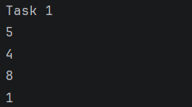
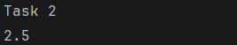
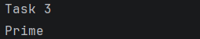
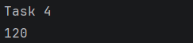
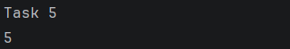
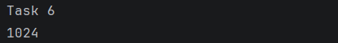
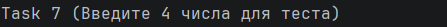
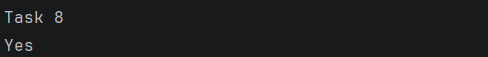
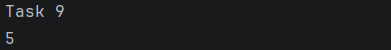
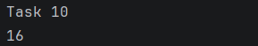

# ADS Assignment 1: Recursion
**Name:** Baglanuly Abay  
**Group:** IT-2504

## Project Description
I solve 10 tasks using only recursive methods in Java.
No iterative loops (for, while) were used in code.

---

## Tasks and Explanations

### Task 1: Print Digits of a Number
* **Logic:** I created a method that first calls itself with n / 10 to reach the leftmost digits. After the recursive call returns, it prints n % 10. This ensures digits are printed in the correct forward order
* **Screenshot:** 

### Task 2: Average of Elements
* **Logic:** I implemented a recursive findSum method that adds the current element arr[n-1] to the sum of the remaining n-1 elements. Also, I divided this total sum by the array length to get the average.
* **Screenshot:** 

### Task 3: Prime Number Check
* **Logic:** The function checks if n is divisible by a divisor (starting from 2). If no divisors are found until divisor * divisor > n, the number is prime. It calls itself with divisor + 1.
* **Screenshot:** 

### Task 4: Factorial
* **Logic:** I used the classic recursive definition: n! = n \times (n-1)!. The recursion stops when n reaches 1 or 0, returning 1.
* **Screenshot:** 

### Task 5: Fibonacci Number
* **Logic:** I implemented the formula F_n = F_{n-1} + F_{n-2}. The base cases are F_0 = 0 and F_1 = 1. It recursively calculates previous values until it hits these bases.
* **Screenshot:** 

### Task 6: Power Function
* **Logic:** To calculate a^n, the function multiplies a by the result of power(a, n-1). The base case is n=0, where any number to the power of 0 is 1.
* **Screenshot:** 

### Task 7: Reverse Output
* **Logic:** The function reads an integer using Scanner, then calls itself for the next number. The print statement is placed after the recursive call, which causes the numbers to be printed in reverse order.
* **Screenshot:** 

### Task 8: Check Digits in String
* **Logic:** The function checks the first character using Character.isDigit(). If it's a digit, it calls itself with the rest of the string (substring(1)). If any character is not a digit, it returns "No".
* **Screenshot:** 

### Task 9: Count Characters in a String
* **Logic:**  I defined the length of a string as 1 + the length of the string without its first character. The recursion stops when the string is empty (length 0).
* **Screenshot:** 

### Task 10: GCD 
* **Logic:** Uses the recursive formula GCD(a, b) = GCD(b, a \pmod{b}) until the remainder is zero.
* **Screenshot:** 

During this assignment, I focused on replacing iterative logic (loops) with recursive calls. For each task, I identified the base case to prevent infinite recursion and the recursive step to move toward that base case. This helped me better understand how the stack works in Java and how to solve complex problems by breaking them into smaller sub-problems.